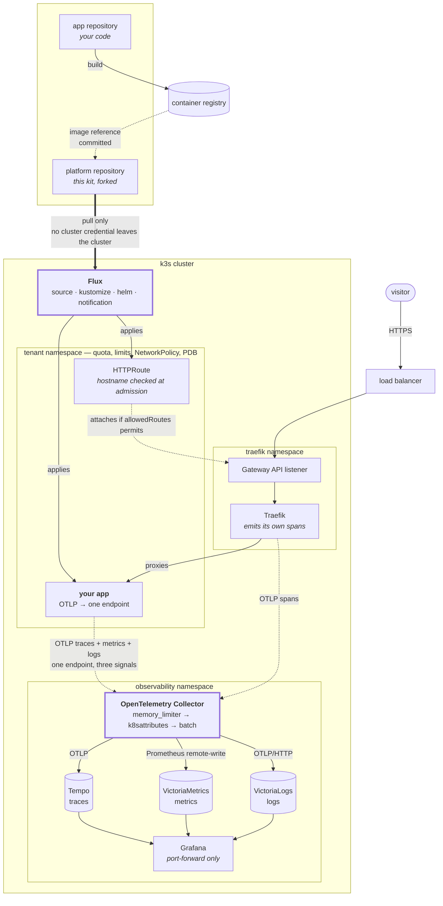

# How a hosted app gets deployed, and how its telemetry gets back

Two separate paths that meet in one place. The delivery path is git-driven and
one-way; the telemetry path is push-based and one-way in the other direction.
Neither knows about the other, which is the property that makes both replaceable.

## The whole picture



## Why the collector sits in the middle

An application can export straight to each store. It works, and it is worse in
three specific ways.

**Context.** A span that goes direct arrives knowing only what the application
knew — which is not the pod, node or namespace it ran in. The `k8sattributes`
processor resolves that from the connection's source address and stamps it on
every signal. This is what makes a trace and the log lines from the same request
line up, and it is why the processor must run **before** batching: once spans are
batched, the association with the connection is gone.

Verified on a live cluster — a request from a laptop over the public internet,
as stored:

```
url.path                  = /trace-probe-5
http.response.status_code = 301
service.name              = traefik

k8s.pod.name        = traefik-5779f9b8df-tg8tg
k8s.namespace.name  = traefik
k8s.deployment.name = traefik
k8s.node.name       = platform-autoscaled-41cf67a3d8ee27ff
```

**Protocol independence.** The metric store speaks Prometheus remote-write, not
OTLP. The collector translates, so the application emits OTLP and never learns
what is storing it. Swapping the store is a change to one file in this
repository, not a redeploy of every workload.

**Three problems the application should not own.** Batching, retry while a store
is unreachable, and sampling policy. Tail-based sampling — keeping a trace
*because* it errored — is only possible somewhere that sees the whole trace,
which no single application does.

## Instrumenting an application

The collector accepts OTLP on gRPC `4317` and HTTP `4318`. Everything below is
standard OpenTelemetry configuration; nothing here is specific to this kit.

```yaml
env:
  - name: OTEL_EXPORTER_OTLP_ENDPOINT
    value: http://opentelemetry-collector.observability.svc.cluster.local:4317
  - name: OTEL_EXPORTER_OTLP_PROTOCOL
    value: grpc
  # The one attribute worth setting by hand. Everything else about *where* the
  # workload runs is stamped by the collector; only the application knows what
  # it *is*.
  - name: OTEL_SERVICE_NAME
    value: my-app
  - name: OTEL_RESOURCE_ATTRIBUTES
    value: deployment.environment=production,service.version=1.4.2
```

**The tenant NetworkPolicy already permits this.** `allow-egress-telemetry` in
the tenant template opens ports 4317 and 4318 to the observability namespace and
nothing else. A tenant that has not been generated from the template will find
its telemetry silently dropped by the default-deny egress rule — which looks
exactly like an application that is not instrumented.

### Getting spans without writing any

Most runtimes have an auto-instrumentation agent that traces the HTTP server,
outbound clients and the database driver with no code change:

| Runtime | Mechanism |
|---|---|
| Java | `-javaagent:opentelemetry-javaagent.jar` |
| Node.js | `--require @opentelemetry/auto-instrumentations-node/register` |
| Python | `opentelemetry-instrument <your command>` |
| PHP | `open-telemetry/opentelemetry-auto-*` extensions, loaded via `php.ini` |
| Go | no agent; import the contrib instrumentation for your router and driver |
| .NET | `OTEL_DOTNET_AUTO_HOME` with the auto-instrumentation bundle |

The generic recommendation is to start with the agent, confirm signals arrive,
and only then add manual spans around the parts of your own code that the agent
cannot see.

### What you get for it

With the ingress emitting spans and the application emitting its own, a single
trace spans the load balancer, the proxy, your handler and its database calls —
so "the page is slow" resolves to a span, not a hypothesis. Adding the metrics
and logs pipelines to the same endpoint means the p99 you are looking at and the
log lines behind it carry identical `k8s.*` labels, and Grafana can pivot between
them.

## What is deliberately not wired

**Nothing is exposed publicly.** The collector is `ClusterIP`. An internet-facing
OTLP receiver is an unauthenticated append-only log that anyone can fill, and the
first symptom is a storage bill. Grafana is reached by port-forward.

**No tail-based sampling by default.** It requires deciding what is worth
keeping, and that decision is workload-specific. The collector is the right place
to add it — `tail_sampling` processor — but a default would be a guess.

**No log collection from stdout in this path.** Container stdout is collected
separately by Vector. The OTLP logs pipeline above is for applications that emit
structured logs through the SDK, which is the only way a log line arrives already
carrying the trace ID that produced it.
